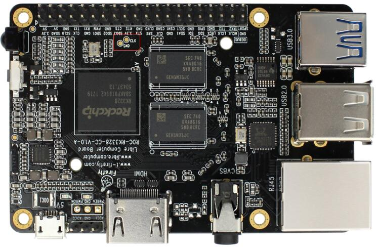

## Boot 模式

eMMC 闪存是直接焊接到电路板上的，所以须使用板载方式来更新固件。

将固件刷入 eMMC 闪存，须使用公对公 USB 线将主机 PC 和电路板的较低 USB OTG 口连接起来

依据现有的 eMMC 闪存，有两种启动模式: [Rockusb 模式] 和 [Maskrom 模式]

通常只需要 [Rockusb 模式] 即可升级现有的 Android 操作系统或 Firefly Ubuntu 操作系统，该操作系统采用 Rockchip 固件格式。

[Maskrom 模式] 是由于 Bootloader 损坏导致 [Rockusb 模式] 无法使用的最后手段，否则须将固件刷入到 eMMC

### Rockusb 模式

如果板子启动并在 eMMC 中找到有效的 IDB（IDentity Block），它将继续在 eMMC 中加载 bootloader（此处使用U-Boot）并将执行控制权交给它,

如果 bootloader 检查按下了 Recovery 按钮并进行了 USB 连接，它就会进入 [Rockusb 模式]，等待来自主机的进一步指示

操作要求:
 - 5V2A 电源适配器
 - 连接电源适配器和板子的 USB 线
 - 用来连接电脑 PC 以及 板子的公对公 USB 线

操作步骤:
 1. 将所有 USB 线（包括 Micro USB 线和公对公 USB 线）拔出板子，以保持电路板断电
 2. 拔出 SD 卡
 3. 使用公对公 USB 线将主机与板子的较低 USB 2.0端口相连
 4. 按住板子上的 RECOVERY 按键
 5. 从板子上拔出 micro USB 线
 6. 等待大概 3 秒左右松开 RECOVERY 按键

### Maskrom 模式

若板子上电后遇到以下情况:
 - eMMC 为空
 - eMMC 上的 bootloader 坏了
 - 将 eMMC 数据/时钟引脚接地，eMMC读取数据失败

这些表示在 eMMC 中将找不到有效的 IDB（IDentity Block），CPU 将执行一个小型的 ROM 代码，等待主机通过 USB 上传一个小的 DDR blob 来初始化DDR内存，然后用一个完整的 bootloader 来处理进一步的固件升级。这种模式称为'Maskrom模式'

因为涉及到强制进入 `MaskRom模式` 的硬件操作，所以具有一定的风险，操作上需要**非常仔细**

操作要求:
 - 5V2A 电源适配器
 - 用来连接电源适配器和板子的 Micro USB 线
 - 连接电脑 PC 和板子的公对公 USB 线
 - 用于将 eMMC 时钟引脚短接到地的金属镊子

操作步骤:
 1. 从板子上拔出所有的 USB 线（包括 micro USB 线以及公对公 USB 线）,保持板子的断电状态
 2. 从板子上拔出 SD 卡
 3. 使用公对公 USB 线连接电脑 PC 和板子上较低的 USB 2.0 口
 4. 找到板子上预留的 eMMC 的 CLK 引脚和 GND 脚，见下图
 
 5. 用金属镊子短接 eMMC 的 CLK 和 GND 焊盘，并保持短接良好
 6. 将 micro USB 线插到板子上
 7. 保持住一秒后松开镊子

[Rockusb 模式]: bootmode.html#rockusb-mode
[Maskrom 模式]: bootmode.html#maskrom-mode

