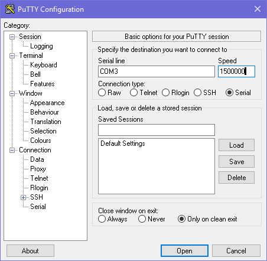

# 串口调试

如果正在进行 U-Boot 或内核开发，USB串口适配器（USB 转串口TTL 适配器的简称）对于检查系统启动日志非常有用，特别是在没有图形桌面显示的情况下。

## 准备 USB 串口适配器

**选择一个 USB 串口适配器** 
[ROC-RK3328-CC] 的 UART 调试口默认使用**1500000**波特率和 TTL 电平。

一些适配器不能支持如此高的波特率。因此在购买之前，请确保它符合要求并有合适的驱动。 可以参考 [Firefly 在线商城](http://shop.t-firefly.com/goods.php?id=32) 上带  `CP2104` 芯片的 USB 串口适配器。

**连接适配器和调试口**

用三根线将 TX/RX/GND 引脚分别连接在一起：


如果在使用某些适配器时串口控制台无输出，可以尝试将适配器的 TX 引脚连接到板子的 RX 引脚，将适配器的 RX 引脚连接到电路板的 TX 引脚，即交换一下 TX、RX 引脚。

**串口参数配置**

[ROC-RK3328-CC] 使用如下配置:

- 波特率：1500000
- 数据位：8
- 停止位：1
- 奇偶检查：无
- 流控：无

接下来，根据操作系统的不同，为你介绍详细操作说明。

## Windows 下的串口调试

**安装驱动**

安装 USB 串口适配器卖家推荐的驱动。如果没有，可以检查芯片组并尝试以下驱动
 - [CH340](http://www.wch.cn/downloads.php?name=pro&proid=5)
 - [PL2303](http://www.prolific.com.tw/US/ShowProduct.aspx?pcid=41)
 - [CP210X](http://www.silabs.com/products/mcu/pages/usbtouartbridgevcpdrivers.aspx)

> 如果 PL2303 在 Win8 下无法工作，则可以尝试将驱动程序降级到版本 3.3.5.122 或之前。

安装驱动后，将适配器连接到 USB 端口。操作系统将提示检测到新硬件。完成后，可以在设备管理器中找到新的COM端口


**安装软件**

Windows 中有很多串口终端工具，例如 putty 和 SecureCRT。以下介绍Putty这款流行的开源软件的使用。

从[这里](http://www.chiark.greenend.org.uk/~sgtatham/putty/download.html)下载 putty，推荐 `putty.zip`。

解压并运行 `PUTTY.exe`：

1. 选择 "Connection type" 为 "Serial"。
2. 将 "Serial line" 修改为在设备管理器中找到的 COM 端口。
3. 设置 "Speed" 为 1500000 。
4. 点击 "Open" 按钮。



## Linux 下的串口调试

如果 USB 串口适配器的芯片组受 Linux 内核支持，驱动程序将自动加载。

连接串口适配器，并通过如下命令检查相应的串口设备文件：

> $ ls -l /dev/ttyUSB0 
> crw-rw---- 1 root uucp 188, 0 Apr 10 16:44 /dev/ttyUSB0

将你的 Linux 用户添加到 `uucp` 组中，以便获得访问此设备的权限（否则每次需要在命令前加`sudo`来运行相应命令）:

> sudo gpasswd -a $(whoami) uucp

用户组的更改将在注销并重新登录 Linux 后生效，或使用 `newgrp` 命令进入带有新组的 shell:

> newgrp uucp

然后根据偏好，使用 picocom 或 minicom 之一。

### picocom
    
`picocom` 轻便小巧， 容易使用。

安装 `picocom` 命令:

> sudo apt-get install picocom

启动 `picocom`:

```
$ picocom -b 1500000 /dev/ttyUSB0
picocom v3.1

port is        : /dev/ttyUSB0
flowcontrol    : none
baudrate is    : 1500000
parity is      : none
databits are   : 8
stopbits are   : 1
escape is      : C-a
local echo is  : no
noinit is      : no
noreset is     : no
hangup is      : no
nolock is      : no
send_cmd is    : sz -vv
receive_cmd is : rz -vv -E
imap is        : 
omap is        : 
emap is        : crcrlf,delbs,
logfile is     : none
initstring     : none
exit_after is  : not set
exit is        : no

Type [C-q] [C-h] to see available commands
Terminal ready
```

上面的消息显示 `Ctrl-a` 是转义键。 按下 `Ctrl-a Ctrl-q` 将退出 `picocom` 并返回到 shell 。

### minicom

安装 `minicom` 命令：

> sudo apt-get install minicom

启动 `minicom`：

```
$ minicom
Welcome to minicom 2.7

OPTIONS: I18n
Compiled on Jan  1 2014, 17:13:19.
Port /dev/ttyUSB0, 15:57:00
                                                                                                                       
Press CTRL-A Z for help on special keys
```

根据以上提示: 按 `Ctrl-a`，然后按 `z`（而不是 `Ctrl-z` ）调出帮助菜单：

```
+-------------------------------------------------------------------+
|                      Minicom Command Summary                      |
|                                                                   |
|              Commands can be called by CTRL-A <key>               |
|                                                                   |
|               Main Functions                  Other Functions     |
|                                                                   |
| Dialing directory..D  run script (Go)....G | Clear Screen.......C |
| Send files.........S  Receive files......R | cOnfigure Minicom..O |
| comm Parameters....P  Add linefeed.......A | Suspend minicom....J |
| Capture on/off.....L  Hangup.............H | eXit and reset.....X |
| send break.........F  initialize Modem...M | Quit with no reset.Q |
| Terminal settings..T  run Kermit.........K | Cursor key mode....I |
| lineWrap on/off....W  local Echo on/off..E | Help screen........Z |
| Paste file.........Y  Timestamp toggle...N | scroll Back........B |
| Add Carriage Ret...U                                              |
|                                                                   |
|             Select function or press Enter for none.              |
+-------------------------------------------------------------------+
```

按提示按 `O` 进入设置屏幕:
```
           +-----[configuration]------+
           | Filenames and paths      |
           | File transfer protocols  |
           | Serial port setup        |
           | Modem and dialing        |
           | Screen and keyboard      |
           | Save setup as dfl        |
           | Save setup as..          |
           | Exit                     |
           +--------------------------+
```

选择 `Serial port setup`，然后按选项前面的大写字母设置为如下所示的值:

```
   +-----------------------------------------------------------------------+
   | A -    Serial Device      : /dev/ttyUSB0                              |
   | B - Lockfile Location     : /var/lock                                 |
   | C -   Callin Program      :                                           |
   | D -  Callout Program      :                                           |
   | E -    Bps/Par/Bits       : 1500000 8N1                               |
   | F - Hardware Flow Control : No                                        |
   | G - Software Flow Control : No                                        |
   |                                                                       |
   |    Change which setting?                                              |
   +-----------------------------------------------------------------------+
```

注意:
* Hardware Flow Control 和 Software Flow Control 应该设置为 No
* 结束设置之后， 按 `ESC` 键回到之前的菜单， 选择 "Save setup as dfl" 保存覆盖掉默认配置.

[ROC-RK3328-CC]: http://en.t-firefly.com/product/rocrk3328cc.html "ROC-RK3328-CC Official Website"

