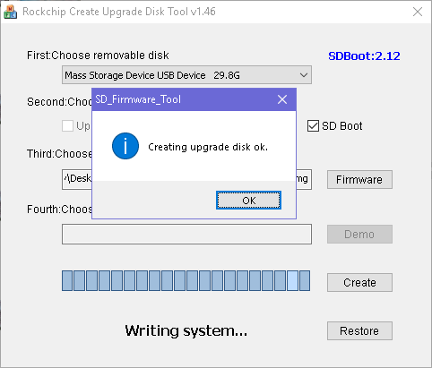

# 烧写 SD 卡

下面我们将介绍如何烧写固件到 SD 卡。如果没有特别说明，以下的固件都是指[原始固件]。关于固件的类型说明可以看[这里](started.html#firmware_format)。

推荐使用 [SDCard Installer] 来烧写固件到 SD 卡。

如果使用 [SDCard Installer] 以外的工具，需要手工到[这里](http://www.t-firefly.com/doc/download/page/id/34.html)下载固件。

以下是支持的系统列表：
 - Android 7.1.2
 - Ubuntu 16.04
 - Debian 9
 - LibreELEC 9.0

**注意**：下载页面提供的全是[原始固件]，官方**不再提供**[RK固件]。

## 准备 SD 卡

作为启动盘，一张**优质可靠、高速读写**的 SD 卡，对于系统的稳定性来说是非常关键。现将 [《如何准备一张 SD 卡(英文)》](https://docs.armbian.com/User-Guide_Getting-Started/#how-to-prepare-a-sd-card)一文的要点摘录如下：
- 遇到启动或稳定性问题，有超过 95% 的可能是电源供应不足或 SD 卡问题（坏卡，坏读卡器，烧写SD卡时出错，卡读写太慢）。
- 推荐使用 Class 10 以上的 SD 卡，并使用专业工具去测试是否真卡。
- 尽量使用带校验的烧写工具。
- 如需将 SD 卡恢复至出厂设置，使用 [SD Formatter](https://www.sdcard.org/downloads/formatter_4/) 工具做格式化。
- 选择以下优质 SD 卡：

      

## 烧写工具

请根据所用主机的操作系统选择相应的烧写 SD 卡工具：

- 烧写 SD 卡
  + 图形界面烧写工具：
    * [SDCard Installer] (Linux/Windows/Mac)
    * [Etcher] (Linux/Windows/Mac)
  + 命令行烧写工具
    * [dd] (Linux)

## SDCard Installer

烧写[原始固件]，最轻松的方式就是使用官方的 [SDCard Installer]，它基于 Etcher / Rock64 Installer 定制，实现了一站式的固件选择和烧录操作，让烧写工作变成轻松简单。

[SDCard Installer] 节省了搜索开发板可用固件的时间。你只需要选择开发板、操作系统，插入 SD 卡，点击烧写按钮即可完成整个写卡工作，实在简单方便。

**安装使用说明**：
1. 点击[这里](http://www.t-firefly.com/doc/download/page/id/34.html)下载[SDCard Installer]。
2. 安装运行：
   + Windows： 解压后运行安装程序，按照提示安装到系统，之后在开始菜单里找到 [SDCard Installer] 并运行它。
   + Linux： 解压后运行其中的 `.AppImage` 文件即可。
   + Mac： 直接双击 `.dwg` 文件，拖动安装到系统或直接运行。
3. 点击 "Choose an OS" 按钮， 在 "Please select your device" 组合框中选择 "ROC-RK3328-CC"。
4. 可用的固件列表将从网络更新，如下图所示：
    
5. 选择所需的操作系统和版本，并点击 "OK" 按钮确认。另外也可以从文件管理器中选择本地的一个固件文件，拖放到 `SDCard Installer`。
6. 插入 SD 卡，工具应该会自动选中该卡；如果插有多张 SD 卡，可以点击 "Change" 按钮进行选择。
7. 点击 "Flash!" 按钮，开始固件下载、烧写和校验，请耐心等待。
    

**注意事项**： 
- 有时，当进度达到 99％ 或 100％ 时，可能会出现卸载 SD 卡的错误，这可以忽略，并且不会损坏烧写到 SD 卡的数据：
    
- 在线下载的固件会缓存到本地目录，下次烧写时不用重新下载。缓存目录可以点击左下角的设置按钮，在 "Download Location:" 处设置。
 
## Etcher

[Etcher] 与 [SDCard Installer] 相比，少了固件选择的集成，但代码比较新。如果 [SDCard Installer] 在烧写 SD 卡中出错，或有什么问题，可以尝试使用 [Etcher] 去烧写，此时直接使用 [SDCard Installer] 缓存目录里的固件即可。

[Etcher] 可以到其[官网](https://etcher.io)去下载，安装和使用与 [SDCard Installer] 比较类似，这里就不再重复。

## dd

[dd] 是 Linux 下常用的命令行工具。

首先，插入SD卡，如果被文件管理器自动挂载，则先将其卸载。

然后通过检查内核的日志查找 SD 卡的设备文件：
> dmesg | tail

如果设备文件为 `/dev/mmcblk0`，使用 `dd` 命令去烧录：
> sudo dd if=/path/to/your/raw/firmware of=/dev/mmcblk0 conv=notrunc

烧写一般所需时间较长，但上面的命令不会显示烧写进度，只能一直等待命令的完成。此时，我们可以使用另一个工具 `pv` 去实现进度条的显示。

安装 `pv`：
> sudo apt-get install pv

然后利用管道操作显示烧写进度：
> pv -tpreb /path/to/your/raw/firmware | sudo dd of=/dev/mmcblk0 conv=notrunc

## SD Firmware Tool

**注意**：以下介绍的是如何将[RK固件]烧写到 SD 卡。

首先，到[这里](https://pan.baidu.com/s/1migPY1U#list/path=%2FPublic%2FDevBoard%2FROC-RK3328-CC%2FTools%2FSD_Firmware_Tool&parentPath=%2FPublic%2FDevBoard%2FROC-RK3328-CC)下载 `SD_Firmware_Tool`，并解压。

运行 `SD_Firmware_Tool.exe`:

1. 插入 SD 卡。
2. 从组合框中选择 SD 卡对应的设备。
3. 勾选 "SD Boot" 选项。
4. 点击 "Firmware" 按钮，在文件对话框中选择固件。
5. 点击 "Create" 按钮。
6. 然后会显示警告对话框，选择 "是" 来确保选择了正确的SD卡设备。
7. 等待操作完成，直到提示成功对话框出现：
    
8. 拔出 SD 卡。

[SDCard Installer]: flash_sd.html#sdcard-installer
[Etcher]: flash_sd.html#etcher
[dd]: flash_sd.html#dd
[SD Firmware Tool]: flash_sd.html#sd-firmware-tool
[原始固件]: started.html#raw_firmware_format
[RK 固件]: started.html#rockchip_firmware_format
